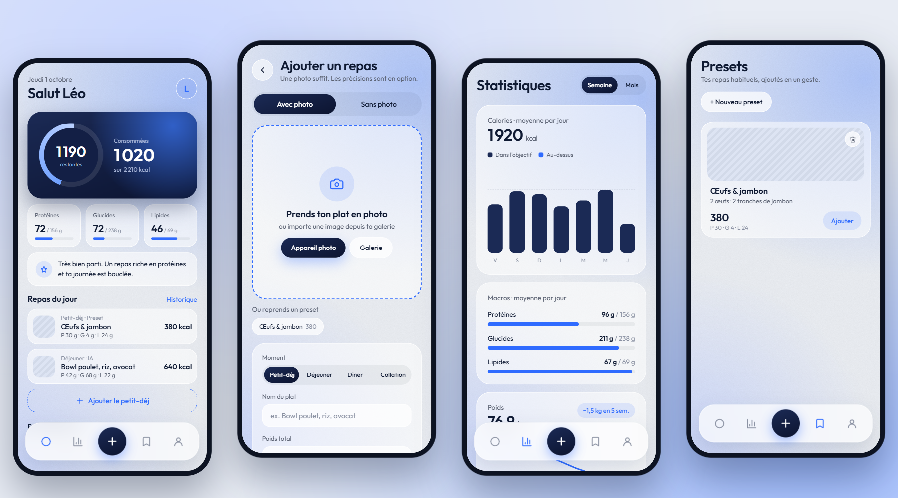
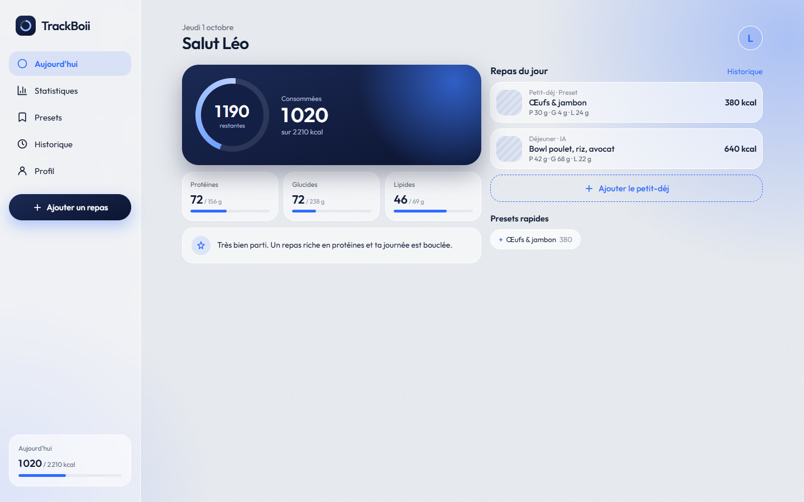
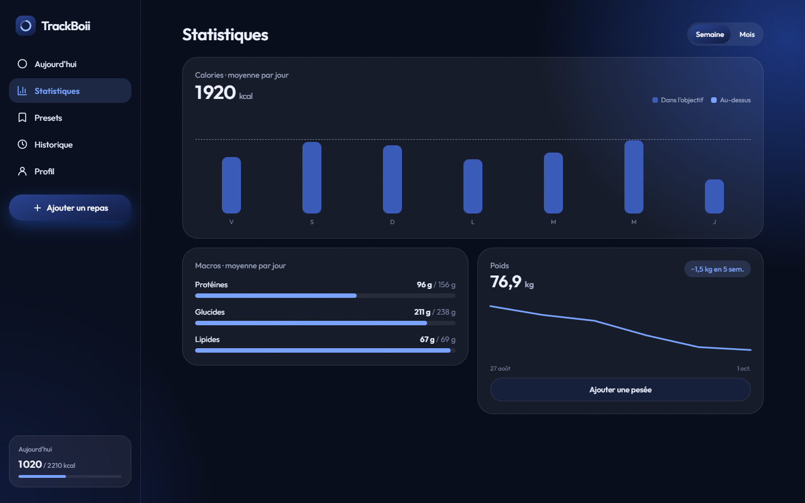

<div align="center">


# TrackBoii

**Prends ton plat en photo. On s'occupe du reste.**

Application de suivi calorique : une photo suffit, l'IA estime les calories et les macros du plat.

[**Essayer l'app →**](https://trackboii.netlify.app)


<picture>
  <source media="(prefers-color-scheme: dark)" srcset="docs/screenshots/showcase-dark.png">
  
</picture>

</div>

## Le concept

Compter ses calories est fastidieux : peser, chercher chaque aliment, additionner. TrackBoii réduit ça à un geste.

1. **Photo du plat**, avec ou sans précisions (nom, poids, ingrédients), ou simple description texte.
2. **L'IA estime** les calories, protéines, glucides et lipides. Tout reste modifiable.
3. **Un repas habituel ?** Enregistre-le en preset : la prochaine fois, un tap suffit.

Un questionnaire au premier lancement calcule les besoins quotidiens selon l'objectif (perte, maintien, prise de muscle).

## Fonctionnalités

- 📸 **Analyse IA des repas** par photo ou par description, avec indice de confiance
- ✏️ **Résultat éditable** : changer le poids recalcule kcal et macros au prorata
- 🎯 **Objectifs personnalisés** (Mifflin-St Jeor + niveau d'activité + rythme choisi), ajustables
- ⚡ **Presets** pour les repas récurrents, ajoutés en un tap
- 📊 **Statistiques** semaine / mois, moyenne des macros, courbe de poids
- 🗓️ **Historique** des 10 derniers jours, repas modifiables
- 🔐 **Comptes** email (avec vérification) ou Google ; chacun ne voit que ses données
- 📱 **PWA installable** sur iPhone, Android et PC, utilisable hors ligne
- 🌗 **Thème clair / sombre**, interface responsive (tab bar mobile, sidebar desktop)
- 📤 **Export CSV** des repas

<table>
  <tr>
    <td></td>
    <td></td>
  </tr>
</table>

## Stack

| | |
|---|---|
| **Front** | React 19, Vite, React Router, CSS sur mesure (design glassmorphism) |
| **PWA** | vite-plugin-pwa (Workbox), police auto-hébergée, cache hors ligne |
| **Back** | Firebase Auth, Cloud Firestore (règles de sécurité par utilisateur) |
| **IA** | API Gemini Flash (vision + sortie JSON structurée), appelée depuis une Netlify Function |
| **Hébergement** | Netlify (site statique + fonction serverless) |
| **Tests** | Vitest |

## Points techniques

- **Clé API protégée** : le navigateur n'appelle jamais Gemini directement. La fonction serverless vérifie le token Firebase de l'utilisateur (signature JWKS, email vérifié) avant chaque analyse.
- **Résilience IA** : plusieurs modèles configurés en cascade ; si l'un est saturé (429 / 503), le suivant prend le relais.
- **Sortie fiable** : réponse contrainte par un schéma JSON, puis normalisée et bornée côté serveur.
- **Images légères** : compression côté client (1024 px pour l'analyse, miniature 320 px stockée avec le repas).
- **Hors ligne** : cache Firestore persistant, écritures optimistes ; l'interface n'attend jamais le réseau.
- **Fluidité** : effets de verre limités aux éléments fixes, fond statique, Firebase et React isolés dans leurs propres chunks.

Détails dans [docs/architecture.md](docs/architecture.md).

## Lancer le projet

**Mode démo** (données fictives, sans compte ni clé API) :

```bash
npm install
npm run demo
```

**Mode complet** (Firebase + IA) : copier `.env.example` en `.env`, le remplir, puis :

```bash
npx netlify dev
```

Le pas-à-pas complet (création du projet Firebase, clé Gemini, déploiement Netlify) est dans [SETUP.md](SETUP.md).

```bash
npm test         # tests unitaires
npm run build    # build de production
```

## Structure

```
src/
├── screens/        # un fichier par écran (Today, Add, Result, Stats…)
├── components/     # Shell (layout), MealSheet, primitives UI
├── data/           # DataContext (Firestore), UiContext (thème, toasts, brouillon)
└── lib/            # logique pure testée : objectifs, dates, stats, image
shared/             # schéma et normalisation de la réponse IA (front + serveur)
netlify/functions/  # analyze.mjs : appel sécurisé à Gemini
firestore.rules     # règles de sécurité
```

## Crédits

Design et conception de l'interface : [YanzBoii](https://github.com/YanzBoii).

## Licence

[MIT](LICENSE)
