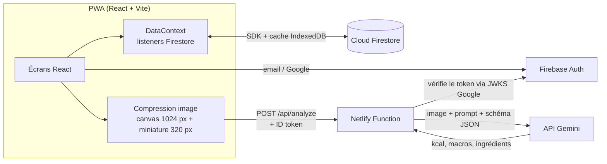

# Architecture technique

## Vue d'ensemble

## Choix techniques

| Sujet | Choix | Pourquoi |
|---|---|---|
| Front | React 19 + Vite + `vite-plugin-pwa` | Une seule base de code pour mobile et desktop, installable, fonctionne hors ligne |
| Routage | `react-router` (BrowserRouter) + redirect SPA Netlify | URLs propres, bouton retour natif sur Android |
| Auth | Firebase Auth (email/mot de passe + Google) | Vérification d'email intégrée, gratuit |
| Données | Firestore + `persistentLocalCache` | Écritures optimistes, l'app reste utilisable hors ligne |
| IA | Gemini Flash, appelé côté serveur | Offre gratuite, vision + sortie JSON structurée ; la clé ne quitte jamais le serveur |
| Hébergement | Netlify (statique + Functions) | Déploiement simple, fonction serverless pour l'appel IA |
| Police | Outfit auto-hébergée (`@fontsource-variable`) | Pas de requête externe, précachée par le service worker |

## Modèle de données (Firestore)

- `users/{uid}` : `name, sex, age, height, weight, goal, activity, pace, targets{kcal,p,c,f}, onboarded`
- `users/{uid}/meals/{id}` : `date ('YYYY-MM-DD' local), moment, name, kcal, p, c, f, weight, ingredients[], thumb (data URL ~25 Ko), source ('IA' | 'Preset' | 'Manuel'), createdAt`
- `users/{uid}/presets/{id}` : `name, items, kcal, p, c, f, weight, ingredients[], thumb`
- `users/{uid}/weights/{date}` : `date, kg`

Un seul listener sur les 31 derniers jours de repas alimente les écrans Aujourd'hui, Stats et Historique : pas de requête supplémentaire en naviguant.

## Sécurité

- **Mots de passe** : jamais stockés par l'app. Firebase Auth les hache (scrypt) ; l'app impose 8 caractères avec lettre et chiffre. Vérification d'email obligatoire, réinitialisation et changement par email, suppression du compte après réauthentification.
- **Règles Firestore** ([`firestore.rules`](../firestore.rules)) : un utilisateur ne lit et n'écrit que sous `users/{son uid}`, et seulement si son email est vérifié. Chaque écriture est validée (champs autorisés, types, bornes, miniature limitée à une image JPEG intégrée de 150 Ko). Couvert par `npm run test:rules`.
- **Fonction `/api/analyze`** : vérifie le Firebase ID token (signature JWKS, issuer, audience, `email_verified`), contrôle la taille et le format des entrées, limite le nombre d'analyses par utilisateur (Netlify Blobs) et accepte une liste blanche optionnelle `ALLOWED_EMAILS`. Les erreurs renvoyées ne divulguent rien d'interne.
- **Clé Gemini** : variable d'environnement côté serveur uniquement.
- **En-têtes HTTP** ([`netlify.toml`](../netlify.toml)) : CSP stricte (aucun script inline), `X-Frame-Options: DENY`, HSTS, `nosniff`, `Referrer-Policy`, `Permissions-Policy`.
- **Appareil partagé** : la déconnexion efface le cache Firestore local et la file d'attente hors ligne.
- **Export CSV** : les cellules commençant par `=`, `+`, `-` ou `@` sont neutralisées (pas d'injection de formule dans Excel).
- La config Firebase côté client est publique par conception ; la sécurité repose sur les règles.

## Hors ligne

- Lecture : cache Firestore persistant (IndexedDB) et coquille de l'app précachée par le service worker.
- Écriture : optimiste, synchronisée par Firestore au retour du réseau.
- Analyse : si le réseau ou l'IA manque, le repas (photo comprise) part dans une file d'attente locale ([`usePendingQueue`](../src/data/usePendingQueue.js)) et il est analysé puis ajouté automatiquement, avec un délai croissant entre deux essais.

## Analyse IA

1. Le client redimensionne la photo (1024 px, JPEG 82 %) et prépare une miniature (320 px) stockée avec le repas.
2. La fonction construit un prompt (les précisions de l'utilisateur sont prioritaires sur l'estimation visuelle) et impose un `responseSchema` JSON.
3. Les modèles sont essayés dans l'ordre de `GEMINI_MODELS` : en cas de 429 / 5xx, on passe au suivant.
4. La réponse est normalisée ([`shared/nutrition.js`](../shared/nutrition.js)) puis affichée dans un écran éditable. Modifier le poids recalcule kcal et macros au prorata.

Sans photo, la même fonction travaille sur la description texte.

## Calcul des objectifs

Formule de Mifflin-St Jeor × facteur d'activité (1,2 → 1,725).
Perte : −(rythme × 7700 / 7) kcal/j · Prise de muscle : + la moitié · Plancher 1200 / 1500 kcal.
Protéines 2 g/kg (1,6 en maintien), lipides 28 % des kcal, glucides = reste. Ajustable à la main dans le profil.

## Performance

- Fond (taches lumineuses, grain) en dégradés statiques derrière le contenu : pas de `filter: blur` ni de `mix-blend-mode` recalculés au défilement.
- `backdrop-filter` réservé aux éléments fixes (tab bar, sidebar, toast, feuille modale).
- Firebase et React dans des chunks séparés : une mise à jour de l'app ne retélécharge que ~18 Ko gzip.
- Écritures Firestore optimistes : l'interface n'attend jamais le serveur.

## Tests

- `npm test` (Vitest) : calcul des objectifs, dates, agrégats de stats, normalisation de la réponse IA, cascade de modèles (budget de temps, disjoncteur) avec un faux Gemini, validation des mots de passe et de l'export CSV.
- `npm run test:rules` : règles Firestore sur l'émulateur (accès entre comptes, email non vérifié, validation des champs et des miniatures).
